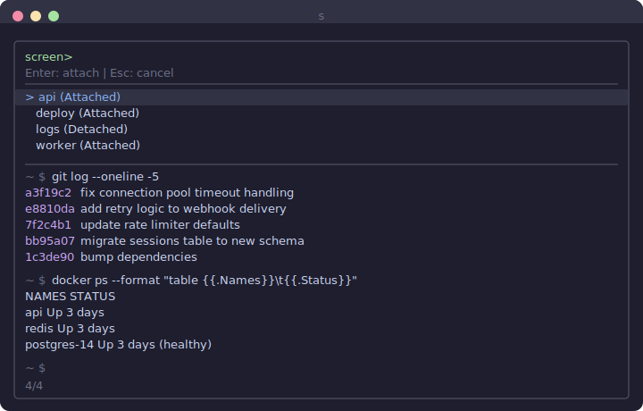

# s

Screen session picker with fzf preview. Works without fzf too.

```
s myproject        reattach or create "myproject"
s                  pick from running sessions
s                  (no sessions) creates one named 2026-02-27
s @host            pick from sessions on remote host
s @host myproject  reattach or create on remote host
```

<p align="center"></p>

## Install

Copy `s` somewhere on your PATH:

```
curl -o ~/.local/bin/s https://raw.githubusercontent.com/john-f/s/main/s
chmod +x ~/.local/bin/s
```

Needs GNU Screen. [fzf](https://github.com/junegunn/fzf) is optional but recommended for the interactive picker with live session previews.

## Remote sessions

Prefix a hostname with `@` to manage screen sessions on a remote machine via SSH:

```
s @devbox
s @devbox myproject
```

The host is passed directly to `ssh`, so anything in your `~/.ssh/config` works. The picker runs locally with previews fetched over SSH. Connection multiplexing is enabled automatically so previews stay fast.
