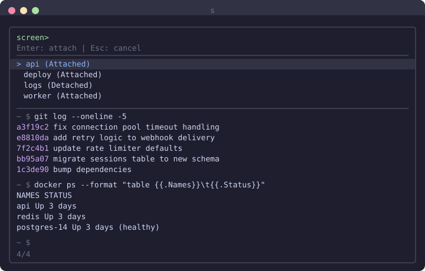

# s

[shpool](https://github.com/john-f/shpool) session picker with fzf preview. Works without fzf too.

```
s myproject        reattach or create "myproject"
s                  pick from running sessions
s                  (no sessions) creates one named 2026-02-27
s @host            pick from sessions on remote host
s @host myproject  reattach or create on remote host
```

<p align="center"></p>

## Install

Install the john-f/shpool fork, which adds the `hardcopy` command used for previews:

```bash
cargo install --git https://github.com/john-f/shpool --locked shpool
```

If shpool was already running, restart its daemon after installing so the client and daemon use the same protocol.

Copy `s` somewhere on your PATH:

```
curl -o ~/.local/bin/s https://raw.githubusercontent.com/john-f/s/use-shpool/s
chmod +x ~/.local/bin/s
```

[fzf](https://github.com/junegunn/fzf) is optional but recommended for the interactive picker with live session previews.

## iTerm2 session labels

When `s` attaches to a session, it shows the shpool session name as an iTerm2
badge overlay. The badge is cleared when the attachment ends, including after
an attachment error. This also works for sessions selected with `s @host`.

To include the same session name in the iTerm2 tab title, add this to your
`~/.bashrc` (or equivalent):

```bash
case "$TERM" in
xterm*|rxvt*)
    PS1="\[\e]0;${SHPOOL_SESSION_NAME:+[$SHPOOL_SESSION_NAME] }\u@\h: \w\a\]$PS1"
    ;;
esac
```

## Remote sessions

Prefix a hostname with `@` to manage shpool sessions on a remote machine via SSH:

```
s @devbox
s @devbox myproject
```

The host is passed directly to `ssh`, so anything in your `~/.ssh/config` works. The picker runs locally with previews fetched over SSH. Connection multiplexing is enabled automatically so previews stay fast.
